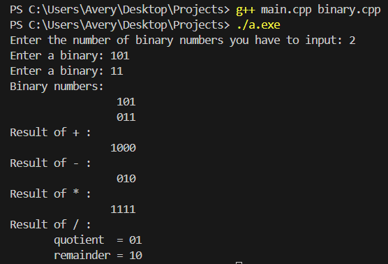

# Binary Computations Project
This project takes multiple binary numbers and adds, subtracts, multiplies, and divides them and displays the results.
This was a class project that stated we had to keep the numbers as binary numbers and not convert them to decimal first.

## Demo

